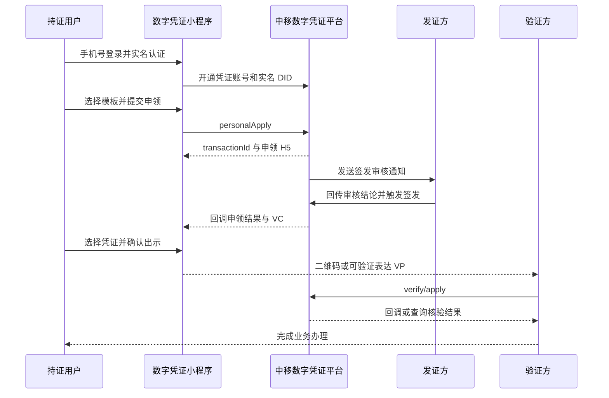

# 数字凭证小程序操作流程

## 一、角色

- 持证方：申领并持有个人数字凭证的用户。
- 发证方：核验用户资料并签发 VC 的权威机构或企业。
- 验证方：在具体业务中接收凭证并核验真伪的机构。
- 数字凭证平台：管理统一账号、DID、凭证模板、授权、核验和存证。

## 二、用户操作流程

1. 用户进入数字凭证小程序，使用手机号码登录并完成实名认证。
2. 平台为用户建立凭证账号和实名 DID，DID 是用户在可信体系中的主体标识。
3. 用户在凭证中心选择凭证类型，例如学历、在网时长或工作凭证，点击申领。
4. 小程序展示申领材料、数据使用目的和授权范围，用户确认并提交。
5. 发证方校验用户身份和业务资料。需要人工审核的凭证进入待签发状态。
6. 审核通过后，发证方生成 VC，平台完成签名与存证，凭证进入生效状态。
7. 用户在“我的凭证”中查看凭证，不需要把原始证明材料反复交给不同业务方。
8. 办理业务时，用户选择凭证并确认授权，通过二维码、H5 或应用内方式出示。
9. 验证方提交核验请求，校验签名、签发方、有效期、状态和挑战码。
10. 核验通过后完成业务办理；凭证被吊销、过期或二维码无效时拒绝办理。

## 三、接口时序

## 四、状态理解

| 状态 | 含义 | 用户结果 |
| --- | --- | --- |
| 待签发 | 申领已提交，等待发证方处理 | 暂不能正式出示 |
| 生效中 | 凭证已签发且在有效期内 | 可以授权出示 |
| 已吊销 | 发证方主动撤销凭证 | 核验不通过 |
| 超时未签发 | 在规定时间内未完成签发 | 需要重新申领 |
| 拒绝签发 | 材料或资格核验未通过 | 查看原因后重新处理 |

## 五、讲解重点

数字凭证不是普通图片或 PDF。VC 包含签发方、持证主体、凭证内容、有效期和数字签名；验证方可以实时验证真伪与状态。用户掌握凭证的出示权，验证方按授权范围使用数据。
