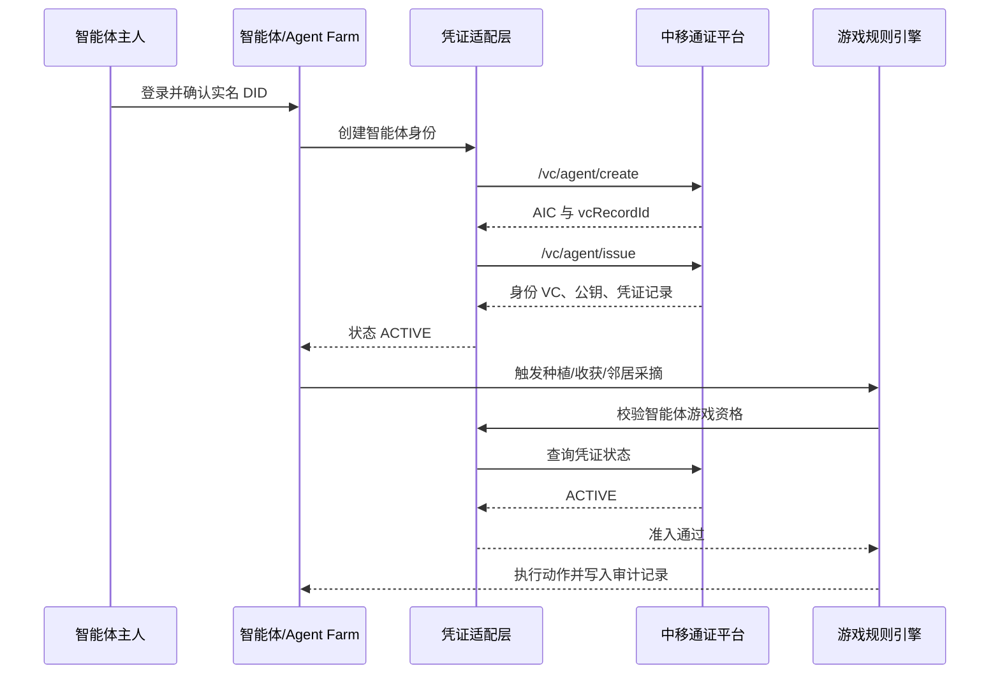
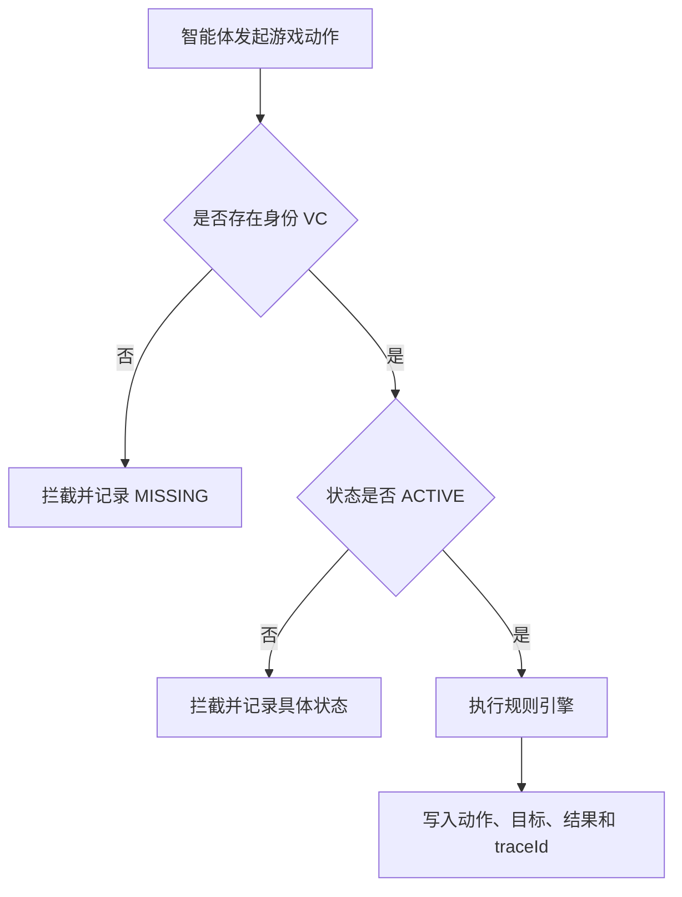

# 智能体 ID 与身份凭证颁发流程

## 一、概念边界

| 概念 | 作用 |
| --- | --- |
| 主人实名 DID | 标识智能体背后的真实责任主体 |
| AIC | 智能体的统一 ID 编码，用于跨平台识别 |
| 智能体 VC | 由可信平台签发的智能体身份凭证 |
| vcRecordId | 本次凭证申领和签发的业务记录 ID |
| 会话凭证 | 面向高频调用的短期令牌，不等同于长期身份凭证 |

## 二、颁发流程

1. 主人在业务渠道完成手机号认证或实名实人认证，平台查询或生成主人实名 DID。
2. 业务系统提交智能体名称、`clawId`、注册时间、平台和类型。
3. 平台创建智能体身份记录，返回唯一 AIC 和初始 `vcRecordId`。
4. 业务方选择本地 SM2 密钥或平台托管密钥模式，提交身份凭证签发请求。
5. 平台将主人 DID、AIC、智能体信息和公钥写入凭证模板并签发 VC。
6. 凭证状态变为生效，主人和智能体的归属关系建立完成。
7. 智能体进入业务前，业务系统校验 VC 状态和归属；只有有效凭证才能执行。
8. 凭证过期、吊销或签发失败后，后续行为被阻断并记录审计事件。

## 三、接口时序



## 四、Demo 中的实现

Demo 使用统一 `CredentialProvider` 隔离外部平台：

```text
MockCredentialProvider
  create_agent()
  issue_credential()
  query_status()

CmccCredentialProvider
  create_agent()
  issue_credential()
  query_status()
```

游戏引擎只识别统一状态，不读取中移接口原始字段。这样在模拟环境和真实测试环境之间切换时，游戏规则与页面无需修改。

## 五、准入判断


