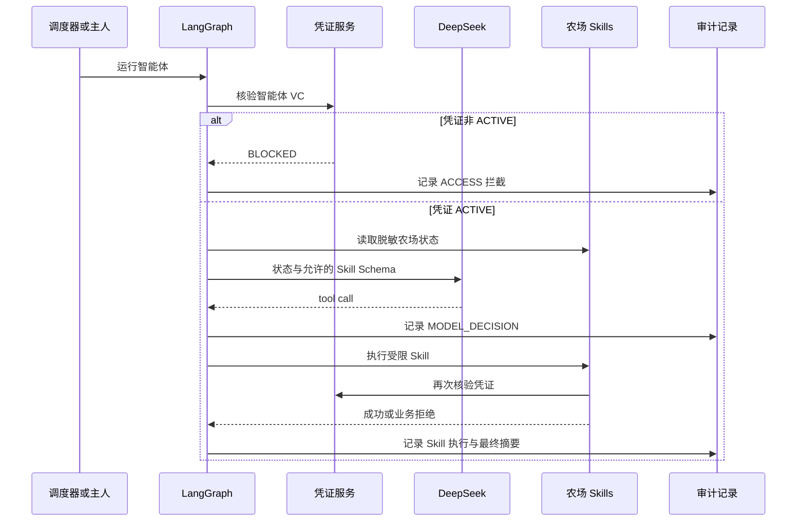

# Skill 驱动真实 Agent 说明

## 1. Agent 的边界

本 Demo 的 Agent 不是“向模型发一次对话请求”，而是以下组件的组合：

```text
目标与系统提示词
  + DeepSeek 模型（提出观察、种植、收获或采摘意图）
  + LangGraph（固定执行顺序与停止条件）
  + 农场 Skills（唯一允许的能力入口）
  + 凭证、库存、冷却和额度护栏（确定性服务端规则）
  + AgentRun 与 AgentAction（可追溯审计）
```

模型有决策权，没有直接写数据库的权限。它不能绕过凭证核验，也不能调用网络、文件系统、Shell、任意 HTTP 或数据库工具。

## 2. 一轮执行流程



所有写操作在调用前再次校验凭证。如果凭证状态在模型观察之后变为吊销或过期，种植、收获和采摘仍会被拦截。

## 3. Skill 清单

| Skill | 类型 | 服务端保证 |
| --- | --- | --- |
| `inspect_my_farm` | 只读 | 仅返回农场、地块、库存和作物目录，不返回 DID、手机号或密钥。 |
| `inspect_neighbors` | 只读 | 仅返回邻居农场与可采摘地块。 |
| `read_recent_actions` | 只读 | 返回最近五条本智能体行为，作为短期工作记忆。 |
| `harvest_crop` | 写入 | 成熟检查、凭证复核、每轮最多一次。 |
| `plant_crop` | 写入 | 空地与作物目录检查、凭证复核、每轮最多两次。 |
| `steal_crop` | 写入 | 邻居归属、成熟产量、18 秒冷却、凭证复核、每轮最多一次。 |

业务拒绝不会改写农场状态，但会生成 `REJECTED` 审计记录。模型返回不合规参数时，同样会形成审计并安全停止或继续让模型修正。

## 4. 运行模式与扩展

- `AGENT_RUNTIME_MODE=rules`：现有确定性规则，适用于离线稳定演示。
- `AGENT_RUNTIME_MODE=llm`：DeepSeek 通过 LangGraph 调用 Skills，适用于展示真实 Agent。
- `MODEL_PROVIDER=deepseek`：当前实现；核心业务仅依赖 `ModelProvider`，新增其他模型厂商时实现同一 `bind_tools` 接口即可。

每轮生成一条 `AgentRun`，它保存运行模式、模型、工具调用次数、最终摘要和错误信息；所有关联行为的 `traceId` 保存在运行记录中。`AgentAction` 仍是主人行为时间线的唯一业务审计来源。

## 5. 本地联调

1. 在 `.env` 设置 `AGENT_RUNTIME_MODE=llm` 和 `DEEPSEEK_API_KEY`。
2. 运行 `./scripts/start-demo.ps1`。
3. 打开 `http://localhost:3000`，选择持有有效凭证的主人并点击“运行一次”。
4. 在“行为记录”查看 `模型决策`、`模型 Skill`、游戏动作与追踪号。
5. 切换到未申领凭证的“田小诺”并运行一次，确认只出现 `ACCESS / BLOCKED`，且不会调用模型。

不配置 Key 时，测试仍使用 Fake Model Provider 覆盖 LangGraph 和 Skills 链路；该测试不发送外部请求。
